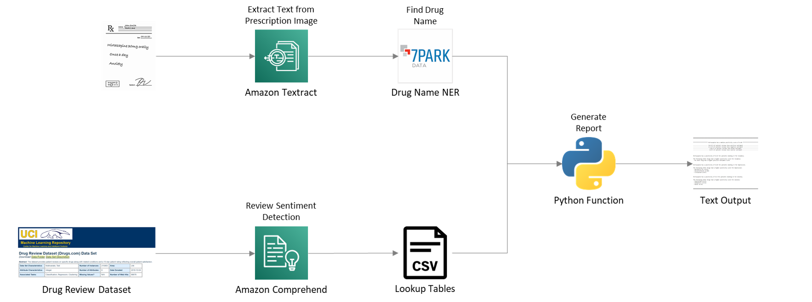

# Drug Sentiment

This solution was created for the [AWS Marketplace Developer Challenge](https://awsmarketplaceml.devpost.com/).

## Description

### Goal: Compare Drug Sentiment from Paper Prescriptions

This solution is intended to provide more information to patients regarding the medication they receive.

Taking a dataset of unstructured text reviews of different drugs, Amazon Comprehend is used to understand the sentiment of the reviews and a function is created to compare sentiment across different drugs.

The solution tackles a second problem which is that of paper-based/handwritten prescriptions (still commonly used across various healthcare systems). Amazon Textract is used to extract text from photocopies or images of paper prescriptions and the 7Park Data drug NER identifies the drug name in the unstructured text data. This then feeds the sentiment comparison lookup for an end-to-end solution.

## Architecture Diagram

